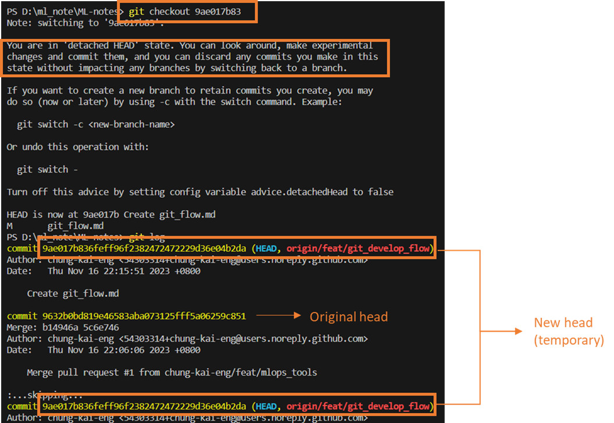

## Git flow 主要三個Senario

- Check Merge vs. Rebase 
- use `git checkout` to change branch
  - Commit some changes
  - stash the change which hasn't commited. (`git stash -u`)
  - push the commit up to `remote`
  - Pull request the branch
  - Pop the stash out and continue doing development (`git stash pop`)
    
### Senario 1 (development)
當要開始一個新功能開發時，可以創建feature branch，等待這個功能開發完成，確定應用到新版本終究合併回develop。
`Rule：從develop創建，最後合併回develop`
`Branch name rule: feature/*;`
`很多地方會使用feature- or feature/`

1. create branch from develop
    `$ git checkout -b feature/test develop` (從develop 拉一分支出來)
    `$ git push origin feature/test`
    
2. 切換到develop 合併feature/test    
    `$ git checkout develop`
    `$ git merge --no-ff feature/test` (`--no-ff` 為創建一個新的commit用於合併的操作，可以避避免丟失該feature branch的歷史存在信息)
    
3. 移除本地和遠端的 feature/test
    `$ git branch -d feature/test`
    `$ git push origin --delete feature/test`
    

### Senario 2 (Release branch 預發布分支)
- 用來做新版本發布前的工作準備，可以在release branch 上做一些發布前的準備。同時，部會影響develop branch 上next version 的新功能開發
- Rule: 從 develop 分支創建，最終合併回 develop & master`
- Branch name rule: release-*
- 流程
    1. create branch 
        `$ git checkout -b release-1.1 develop`
        `$ git push origin release-1.1`
        
    2. 切換到 master 合併 release-1.1
        `$ git checkout master`
        `$ git merge --no-ff release-1.1`
        `$ git tag -a 1.1`
        `$ git push origin 1.1`
        當預示著我們可以發布，打上對應版本號，再push 到remote
        
    3. 切換到develop 合併release-1.1
        `$ git checkout develop`
        `$ git merge --no-ff release-1.1`
        
    4. 移除local & remote的release-1.1
        `$ git branch -d release-1.1`
        `$ git push origin --delete release-1.1`
        

### Scenario 3 (Hotfix branch)

Rule: 從master上當前版本號的tag切出，從最新的master上創建，最終合併回develop & master
Branch name rule: hotfix-*

1. create fixbug branch
    `$ git checkout -b fixbug-1.1.1 master`
    `$ git push origin fixbug-1.1.1`
    
2. 切換到master合併fixbug-1.1.1
    `$git checkout master`
    `$ git merge --no-ff fixbug-1.1.1`
    `$ git tag -a 1.1.1`
    `$ git push origin 1.1.1`
    Bug 修完後，合併回master並打上版本號
    
3. 切換到develop合併fixbug-1.1.1
    `$ git checkout develop`
    `$ git merge --no-ff fixbug-1.1.1`
    
4. 移除local & remote fixbug-1.1.1
    `$ git branch -d fixbug-1.1.1`
    `$ git push origin --delete fixbug-1.1.1`
    

只是**一種規範**，讓整個團隊遵守某個工作流程的規範，比較不會發生問題。


## Git: 回復到之前版本 (`checkout, reset, revert`)
- **HEAD**: 一個指標，告訴我們現在在整個 git history 的哪個位置、哪個分支。HEAD 會指向當前分支最新的那個commit，但也可以讓HEAD 指向任何一個commit，這種情況我們稱為 **detached HEAD**
```bash
# 查看現在指向哪個位置
cat .git/HEAD 

# Output ref: refs/heads/feat/add_git_knowledge
```
### git checkout: `checkout` 就是移動 **HEAD** 的位置。
    - 切換分支
    - 切換位置 指向指定 commit id: **detached HEAD** 有點像是暫時的 branch，離開時就會被刪除
```bash
# 切換分支
git checkout master
git checkout feature

# 切換到 commit id 的分支 (detached branch)
git checkout be235gf
```



### git reset
- `reset`: 一樣可以回到之前的版本，但不像 `checkout` 會開一個暫時的detached HEAD，他會實際把當下的branch 退回到你回到的地方 (移動 HEAD)。
- Use Case: 做了一些程式改動，但因某些原因不想要了，但已經提交了幾個commit，這時就可以使用 `reset` 回到 commit 之前的版本
```bash
# ~n 表示回到 HEAD 的 前 n 版本
git reset HEAD~1
git reset HEAD~2

# HEAD^ 表示 HEAD的前一個版本
git reset HEAD^

# 可以直接使用 commit id
git reset be235gf
```
- 用了 `reset` 會察覺code 沒有改變，這是因為 git default 會做 `git reset --mixed xxx`。雖然commit回到過去的版本，但版本之後的這些改動並不會消失，而是回到working directory。是一種保護機制。
- 若要真正回到過去某個 commit id，可以用 `git reset --hard xxx`。`hard` 部會把程式改動回 working directory

### git revert
- 跟 `checkout & reset` 又有些不同，他回復版本的方式並不是移動 `HEAD`，他會幫忙複製新的 commit，這個commit 會把我們要 `revert` 的 commit 的內容給逆向操作一遍。

```bash
git revert HEAD

git revert be235gf
```
- Use Case: 通常個人project 有 `reset` 讓 commit history 看起來比較乾淨。`revert` 比較是使用在跟他人合作時，會共用repository，一但你的commit 推到`remote` 再用 `reset` 會改變本來branch history，會不太建議影響到其他人，所以此時用 `revert` 較為合適。
- 在團隊當中可能有人程式改動造成嚴重bug 且沒辦法立刻找出原因的話，就會把有問題的commit 給 `revert` 達到 rollback 的效果。


Reference:
[Merge vs. Rebase](https://june.monster/git-merge-rebase/)